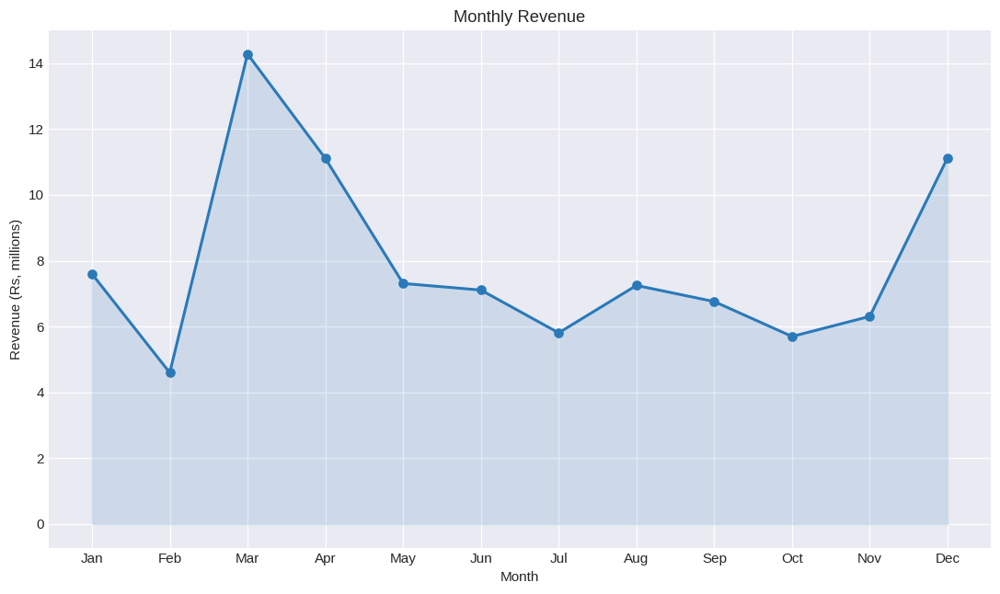
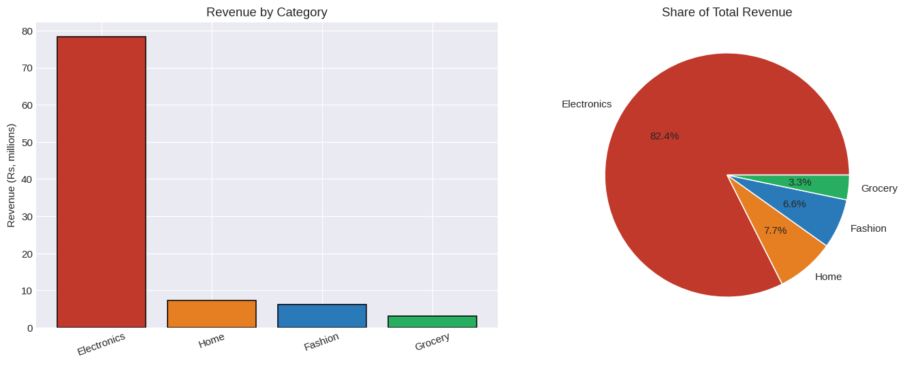
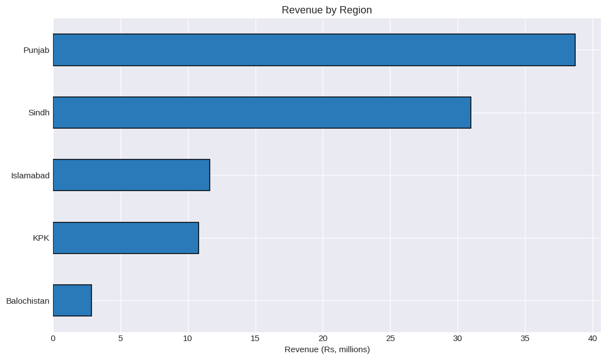
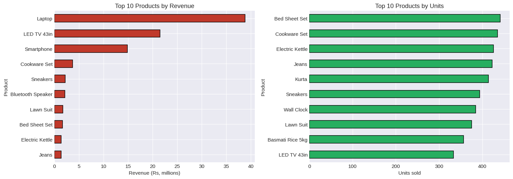
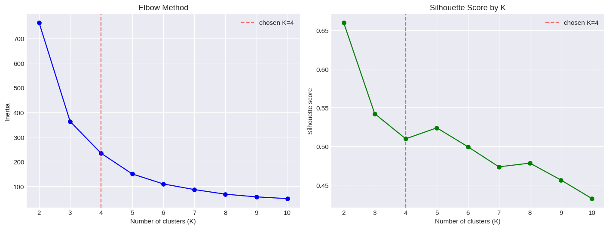
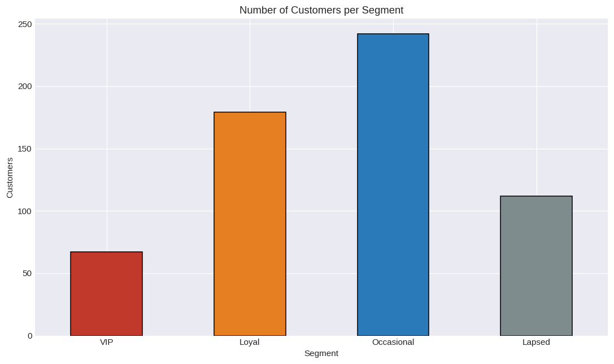
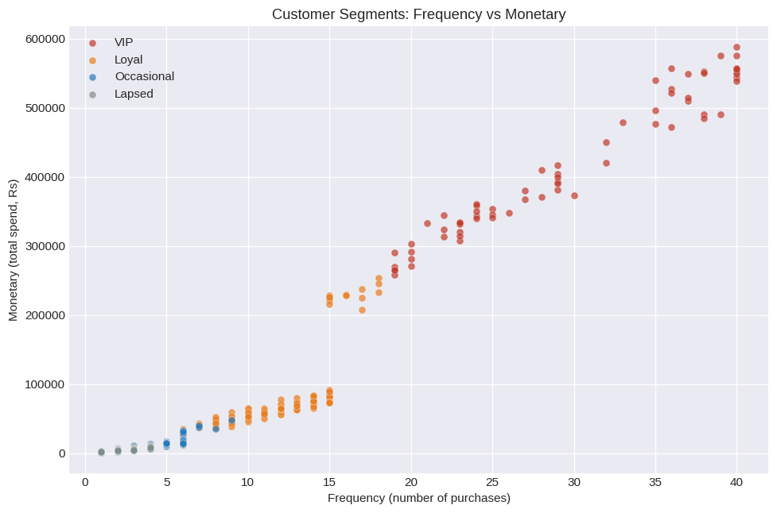
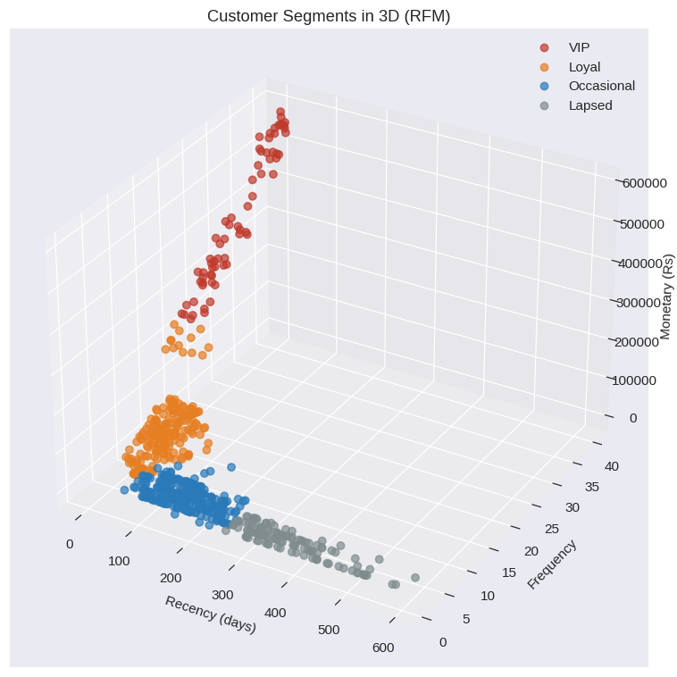

# CloudExify Data Science Internship 2026 — Month 1 (Final Submission)

**Name:** Syed Haseeb Badshah
## description
A two-part data analysis project. The first component cleans raw sales data (handling duplicates and missing values), then aggregates and visualizes revenue trends by month, category, and region. The second component computes RFM (Recency, Frequency, Monetary) scores for each customer, scales the features, and applies K-Means clustering to group customers into segments — with the optimal number of clusters chosen using the elbow method and silhouette scores, and clusters automatically labeled by spend level rather than arbitrary cluster numbers.

Two projects in one repository:

| # | Project | Notebook | Techniques |
|---|---------|----------|------------|
| 1 | Sales Data Analysis | `sales_analysis.ipynb` | pandas cleaning, groupby, pivot tables, matplotlib |
| 2 | Customer Segmentation | `customer_segmentation.ipynb` | RFM analysis, StandardScaler, K-Means, elbow + silhouette |

## Files

```
cloudexify-ds-final-syed-haseeb-badshah/
├── sales_analysis.ipynb          # Project 1 (with outputs saved)
├── customer_segmentation.ipynb   # Project 2 (with outputs saved)
├── sample_data/
│   ├── sales_data.csv            # Project 1 dataset (raw, with the messes)
│   ├── sales_data_clean.csv      # written by the Project 1 notebook
│   └── customer_transactions.csv # Project 2 dataset
├── charts/                       # every chart exported as PNG
├── generate_data.py              # script that creates both datasets
├── sales_report.txt              # generated by Project 1
├── segmentation_report.txt       # generated by Project 2
└── README.md
```

## How to run

Needs pandas, numpy, matplotlib and scikit-learn (all included in Anaconda,
or `pip install pandas numpy matplotlib scikit-learn jupyter`).

```
python generate_data.py          # optional — the CSVs are already included
jupyter notebook
```

Open either notebook and use **Kernel > Restart & Run All**. Both notebooks
read their data from `sample_data/`, so run them from the repository root.

## About the datasets

No dataset was provided with the brief, so I generated both with
`generate_data.py` and a fixed random seed, made to look like a Pakistani
retail business (prices in Rs, real city and region names, a festival-season
sales bump).

Being honest about what that means: the patterns the notebooks find are the
patterns I built into the data. The **method** is what transfers to real
data, not these particular numbers. Where a result is partly a consequence
of how the data was made, I say so in the notebook rather than presenting it
as a discovery.

---

## Project 1 — Sales Data Analysis

**Question:** how do sales move through the year, and where does the money
come from?

**Method:** load 2,615 orders → check quality → clean → aggregate → visualise.

The raw file has deliberate problems, and each one gets a different fix:

| Problem | Fix | Why |
|---|---|---|
| 15 duplicate rows | dropped | the same order counted twice inflates revenue |
| 20 missing `Amount` values | recalculated as `Units × UnitPrice` | the information is still in the other columns, so dropping rows would waste good data |
| 20 missing `Region` values | filled from the `City` column | each city belongs to exactly one region, so this is recoverable with certainty |

**Findings**

- Total revenue Rs 94.97M across 2,600 clean orders, average order Rs 36,527.
- **March is the strongest month** (Rs 14.28M) and February the weakest
  (Rs 4.60M) — a 3.1x gap driven by the festival season.
- **Electronics is 82% of revenue** from a small share of the orders, while
  Grocery sells the most units. Revenue leaders and volume leaders are two
  different lists, so they need two different strategies.
- **Punjab and Sindh are 73% of revenue.** Marketing spend goes furthest
  there; Balochistan (3%) is a growth question rather than a maintenance one.

| Monthly revenue | Revenue by category |
|---|---|
|  |  |

| Revenue by region | Top products |
|---|---|
|  |  |

---

## Project 2 — Customer Segmentation

**Question:** which natural groups do the 600 customers fall into, and what
should the business do about each one?

**Method:** RFM scores per customer → StandardScaler → choose K → K-Means →
profile, name and visualise the segments.

### Choosing K — the one decision worth reading

The brief suggests K = 3. I used **K = 4**, and the notebook shows the
working rather than asserting an elbow that is not really there:

| K | Inertia | Drop from previous | Silhouette |
|---|---|---|---|
| 2 | 763 | — | **0.660** |
| 3 | 363 | 400 | 0.542 |
| 4 | 234 | 129 | 0.510 |
| 5 | 151 | 83 | 0.524 |

A strict elbow reading points at K = 3, and silhouette is highest of all at
K = 2 — but a two-way split only separates big spenders from everyone else,
which is too blunt to plan around. Among the useful options K = 3 and K = 4
are close. I chose K = 4 for a business reason: at K = 3
the customers who have *stopped buying* get merged into the low-value group,
so the model cannot tell "small buyer" from "lost customer" — and those two
need opposite marketing. K = 4 separates them, which is what makes the
recommendations actionable. Switching back is a one-line change
(`n_clusters=3`); the segment-naming code adapts automatically.

### Naming the segments

K-Means numbers its clusters **randomly** (0, 1, 2, 3 in a different order
each run), so the sample code's fixed mapping of "cluster 0 = Low value" is
not reliable. After clustering I sort the clusters by average spend and name
them from lowest to highest, so the names always match what the group
actually is. This is the part of the project I am most happy with.

### The segments found

| Segment | Customers | Avg spend | Recency | Frequency | Share of revenue |
|---|---|---|---|---|---|
| VIP | 67 (11%) | Rs 415,832 | 22 days | 30 | **64.2%** |
| Loyal | 179 (30%) | Rs 68,121 | 52 days | 11 | 28.1% |
| Occasional | 242 (40%) | Rs 11,384 | 155 days | 4 | 6.4% |
| Lapsed | 112 (19%) | Rs 5,103 | 371 days | 2 | 1.3% |

**Recommendations**

- **VIP** — 11% of customers, 64% of revenue. Exclusive offers, early
  access, priority service. Losing one of these costs the same as losing
  about 80 occasional buyers.
- **Loyal** — loyalty rewards and gentle upselling to move them toward VIP.
- **Occasional** — the biggest group and the biggest growth opportunity;
  bundles and reminders to increase how often they buy.
- **Lapsed** — quiet for roughly a year. Win-back discounts, which cost less
  than acquiring new customers.

| Choosing K | Segment sizes |
|---|---|
|  |  |

| Segments (Frequency vs Monetary) | Segments in 3D |
|---|---|
|  |  |
